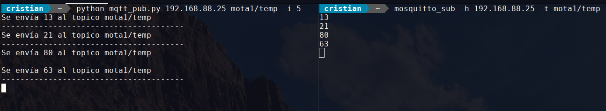

# Practica 5 - IoT Facultad de Informática UNLP


#### Ejercicio 3
Escribir un programa que se subscriba a un tópico del broker MQTT que recibirá información de una mota de la red de sensores por ej: “facultad/aula8/mota1/temperatura”. Cuando reciba una nueva publicación deberá guardarla en una medida de influxDB y graficar su evolución en Grafana.

#### Ejercicio 4
Para alimentar el ejercicio anterior vamos a crear un script que publique en ese tópico una valor aleatorio por minuto.

**Se pide la resolución del ejercicio 4.**

### Dependencias
Antes de poder utilizar el script necesitamos instalar paho-mqtt.
```bash
pip install paho-mqtt==0.4.94
```

Se utilizó una versión vieja, la 0.4.94 por un tema de compatibilidad con la máquina virtual de Cooja. Ya que con la versión nueva daba error de mensajes MQTT.

También por un tema de compatibilidad se utilizó python2.


## Instrucciones de uso.

El programa `mqtt_pub` consiste de un cliente que publica cada cierto tiempo un mensaje en un broker de un host determinado.

```bash
python mqtt_pub.py --help
usage: mqtt_pub.py [-h] [-i INTERVAL] [--version] host topic

positional arguments:
  host                  Una ipv4.
  topic                 Un topico. Por ejemplo test/hello

optional arguments:
  -h, --help            show this help message and exit
  -i INTERVAL, --interval INTERVAL
                        interval in seconds to repeat query. 60 segs by
                        default
  --version             show program's version number and exit
```

### Ejemplo

El siguiente comando publicará en el topic `mota1/temperatura` un valor aleatorio cada 30 segundos: 
```
$ python mqtt_pub.py localhost mota1/temperatura -i 30
```

Si no se especifica el intérvalo con `-i`, el valor por defecto será cada 60 segundos. En el siguiente ejemplo publicaremos en el host `192.168.88.25` en el broker `mota1/temp`.

Nos suscribimos al broker de la siguiente manera.
```
$ mosquitto_sub -h 192.168.88.25 -t mota1/temp
```
Ejecutamos el script:

```
python mqtt_pub.py 192.168.88.25 mota1/temp -i 5
Se envía 38 al topico mota1/temp
---------------------------------------
Se envía 96 al topico mota1/temp
---------------------------------------
```

El suscriptor recibirá los siguiente mensajes:
```
$ mosquitto_sub -h 192.168.88.25 -t mota1/temp
38
96
```

### Screenshot



